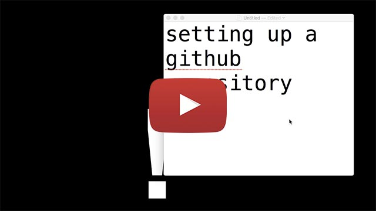
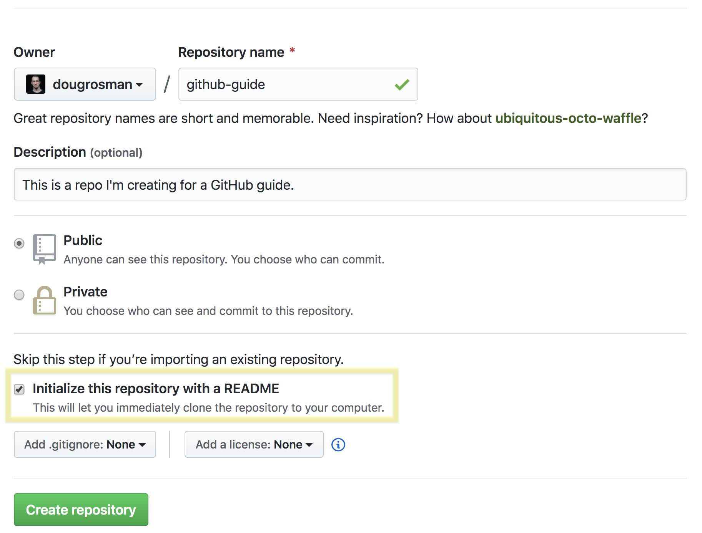
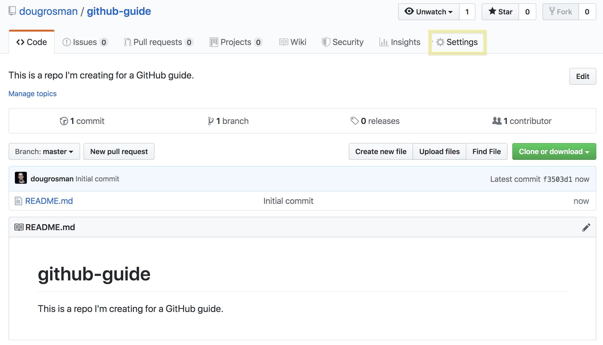
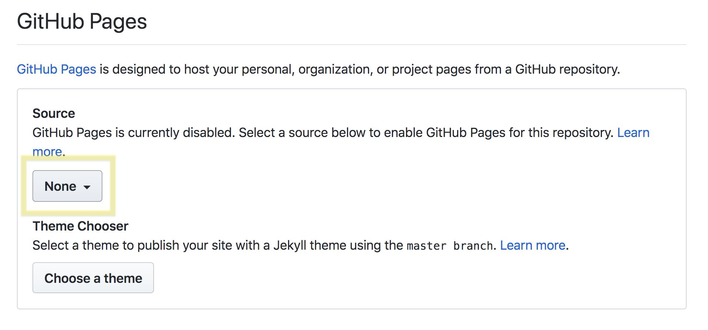
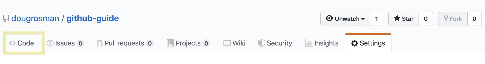
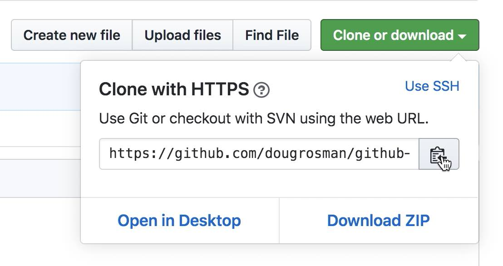
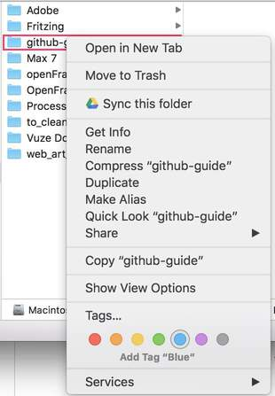
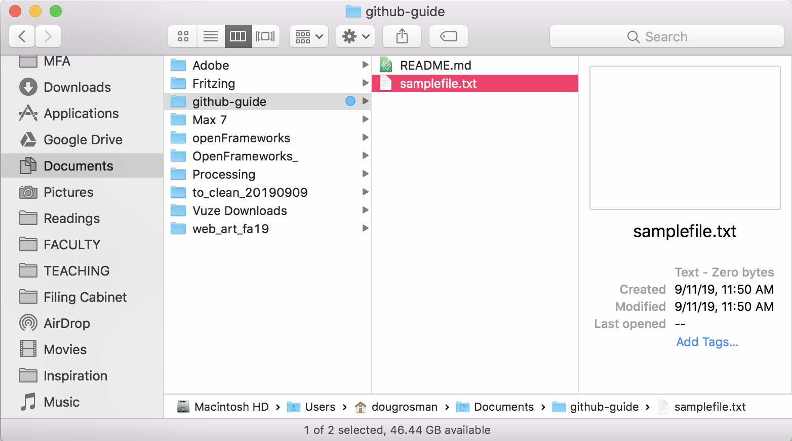

# git and GitHub!

Here's a to-the-point guide for the way we'll be using GitHub in class.

**_Note:_** You'll see some steps that tell you to do something, and then there will be some command line syntax
```
$ That looks like this below it
```
When you see those command line prompts, you can copy and paste them into the terminal, _but don't copy the $ at the beginning–just the text that follows it._
___
### Part 1: Starting from Scratch
### Part 2: Regular GitHub usage after initial setup
__If you've already cloned your repository on your local machine, scroll down toward the bottom of this page to Part 2.__

<a href="https://youtu.be/on7FnkFRr8U" target="blank"></a><br>
_Note: This quick video covers all of part 1 of this guide, but without any annotation. The video is a good refresher if you've already gone through the guide._

## Part 1: Creating a GitHub Repository

1. Go to https://github.com/yourusername
1. Click the 'Repositories' tab
1. Click the green 'New' button on the right side of the window
1. In the 'Create a new Repository' Page
    1. Name your Repository (something like my-blockchain-project, or myBlockchainProject)
    1. Write a description
    1. Set it to public or private
    1. Check the box next to 'Initialize this repository with a README'
    1. Click 'Create repository'

<br>
1. On your new Repository Page, click 'Settings'


1. Scroll all the way down until you get to the 'GitHub Pages' section. We do this step to make our repository function as a website!

1. Under 'Source', click the dropdown where it says 'None' and select 'master branch.' Once selected, the changes will automatically occur.


<br>
1. Your website will be live at https://youraccountname.github.com/your-repo-name
1. Click 'Code' to return to the repo home page


1. Click the green 'Clone or download' button

1. Copy the URL (you can click the clipboard button to copy the URL)

<br>
1. Open a new Finder window and navigate to your 'Documents' folder (we won't do anything here yet).
1. Open a new Terminal window (Press 'Command + Space' on your keyboard to open Spotlight Search, and then type 'Terminal'. If 'Terminal' is highlighted, Press 'Return' to open the Terminal window)
1. Change directory into your documents folder
```
$ cd Documents
```
1. Clone the repository into your 'Documents' folder (or wherever you want, but 'Documents' seems like a good place). A new folder should appear in your Documents folder in Finder!
```
$ git clone https://github.com/dougrosman/your-repo-name.git
```

1. Change directory into the repository you just cloned.
```
$ cd your-repo-name
```

1. Create a sample file to upload.
```
$ touch yourfilename.txt
```

1. Add the specific file to the git head to prepare for upload
```
$ git add yourfilename.txt
```
or
```
$ git add .
```
(Putting the '.' character here means "add all the files in this directory to the git head. This would be useful if you wanted to add a lot of files all at once.)
1. Commit the changes to your GitHub master branch
```
$ git commit -m "Add yourfilename.txt"
```
(the text in the quotations is a little note to yourself that describes the changes you made. Conventially, commit messages use the present tense. So you wouldn't say "updated my smart contract", but: "update smart contract")
1. Upload the file to GitHub
```
$ git push
```

_<sup>Caption: A condensed version of all the commands you'll have done</sup>_
1. Go back to your GitHub account in your web browser and refresh the page to see your newly uploaded file.<br>
    _note: if you made any changes to files that affect your website, it will take 20-30 seconds for those changes to take effect in your website._

Tip: Right-click on the repository folder in Finder and add a color tag so it's easy to identify the folder.<br>
    <br><br>
    
    
    
___


## Part 2: Uploading to GitHub after your repository is set up
Any changes you make to your website you'll need to upload to GitHub for the changes to take effect. Once you've made some changes to a file on your site (ex: index.html), open a Terminal window and follow these steps. __*Make sure you've saved your file(s) before adding, committing and pushing to GitHub.*__

1. Change directory into your repository.<br><br>
```
$ cd Documents/your-repo
```
1. Add your new files, commit the changes, and push to GitHub! (do these commands one at a time)
```
$ git add .
$ git commit -m "A note that describes your changes"
$ git push
```
I do these 3 commands every 10 minutes or so when I'm working on my projects. To make uploading to GitHub a quick process, take advantage of the fact that in the Command Line/Terminal the __Up Arrow Key__ on your keyboard will show you commands you typed previously.

In Terminal,
1. Press the __Up Arrow Key__ 3 times to get to your ```$ git add . ``` command and press 'Return'
1. Press the __Up Arrow Key__ 3 times again to get to your ```$ git commit -m "message" ``` command and press 'Return'
1. Press the __Up Arrow Key__ 3 times again to get to your ```$ git push ``` command and press 'Return'

Repeating the above 3 steps will make committing your changes and uploading them to GitHub quick and painless.
